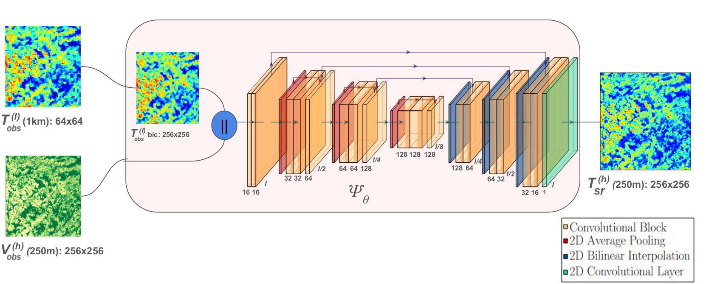
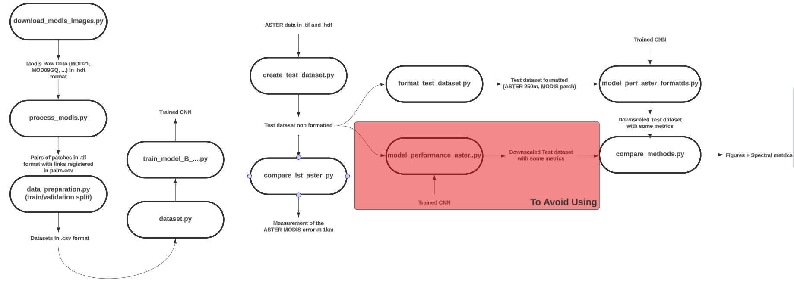

# Land Surface Temperature Super-Resolution with a Scale-Invariance-Free Neural Approach: Application to MODIS
## Goal
The architecture of the model is represented below:

<p align="center">
  
</p>

## Requirements

The easiest way to install the required libraries is to use the environment.yml file: 
``` 
conda env create -f environment.yml
```
The prefix line inside environment.yml should be modified to create the environment at the right path.  

[comment]: <> (If it doesn't work try: conda create --name myenv python=3.12 gdal scikit-image opencv pandas numpy)
[comment]: <> (and then: conda install pytorch torchvision torchaudio pytorch-cuda=12.1 -c pytorch -c nvidia)
[comment]: <> (However, I am not 100% sure if all the library would be present)

## Project description
### Folders
- **data** : Folder containing the MODIS images used to train the super resolution NN models (.hdf, .gtiff, .csv).
- **figures_test_dataset**: Folder containing all the figures obtained for the test dataset taken on Western-Center Europe
- **models**: Directory containing the trained CNNs and key information: Weights, State_dict, training and testing curves.
- **predictions**: Folder only interesting if the model is used to predict on MODIS data directly. Works with predict.py.
- **test_data_formatted**: Directory containing the test dataset with coupled ASTER and MODIS concomitant images. 

### Scripts and codes

- **download_modis_images.py**: Script using pymodis in order to download all the .hdf files associated to the tile h18v04 during a specified time period for the products MOD11A1.061 (LST GSW), MOD21A1D.061 (LST TES), MOD09GQ.061 (NIR, Red) and MOD09GA.061 (RGB). It is also possible to download the product MOD44W (Water Mask) but it is not used in this work.   
```
python download_modis_images.py --username your_username --password your_password --start_date 2023-08-01 --stop_date 2023-08-08 --n_threads 8
```
- **process_modis.py**: Script to run after download_modis_images.py. This script processes the .hdf files from MOD11A1.061 to get LST patches of size 64x64 not containing sea or cloud pixels (or containing a small ratio of cloud/sea pixels). These files are saved under the GeoTiff format. The corresponding 256x256 NDVI patches are then sliced from MOD09CQ.061's .hdf files and also saved in the same way. Finally, two .csv files (one for day and another for night acquisitions) are generated containing the pairs of LST/NDVI patches.  
``` 
python process_modis.py
```
- **data_preparation.py**: File preparing the two .csv files resulting from process_modis.py. The .csv files resulting from process_modis.py are manipulated and transformed into two new .csv files ModisDatasetA.csv and ModisDatasetB.csv which will then be used in dataset.py. Some statistics of the LST and the NDVI are also computed and stored.
- **train_model_B.py**: Training of the modelB. It is trained to produce super resolution images of the LST taking as inputs the bilinear upsampled LST and the associated NDVI. This script is declined into two scripts: train_modelB_predef_filters (training of SIF-NN-SR1) and train_model_B_gradFTM (training of SIF-NN-SR2).
``` 
python train_model_B.py --params ./paramsB.json
``` 
- **model_perf_aster_formatds.py**: Script assessing the performances of the super resolution algorithms over the test dataset. It stores the super resolution products and evaluation metrics at ./test_data_formatted/results/.
- **compare_methods.py**: Script to make some observations, plots, measuring the fourier space similarity metrics, etc...
- **Evaluation_of_MODIS_SuperResolution_LST.ipynb**: Small working example code for the reprojection, georeferencing and the evaluation of the performance of a downscaling approach for a single pair of MODIS and ASTER observations present in the formatted test dataset. 
- **dataset.py**: Definition of the classes containing the two pytorch datasets. These datasets are based directly on the two .csv files coming from data_preparation.py.
- **model.py**: Definition of the pytorch models to train. This file contains the definition of all the sub-blocks of the ModelB.
- **utils.py**: File regrouping the definition of multiple functions used throughout the entire project.
- **lpips.py**: Source code obtained from https://github.com/photosynthesis-team/piq. 
- **data_mining_sharpener.py**: Refactored code (in a single source file) from Guzinski and Nieto's PyDMS implementation: https://github.com/radosuav/pyDMS.
- **data_mining_sharpener_modified.py**: Modified **data_mining_sharpener.py** to work well with the patches inside the formatted test dataset.

### Other
- **paramsX.json**: JSON file containing all the parameters used during the training of the models. The files should be closely inspected since some parameters are crucial for a good training.


## Flow chart

<p align="center">
  
</p>

## Results 
See Evaluation_of_MODIS_SuperResolution_LST.ipynb
